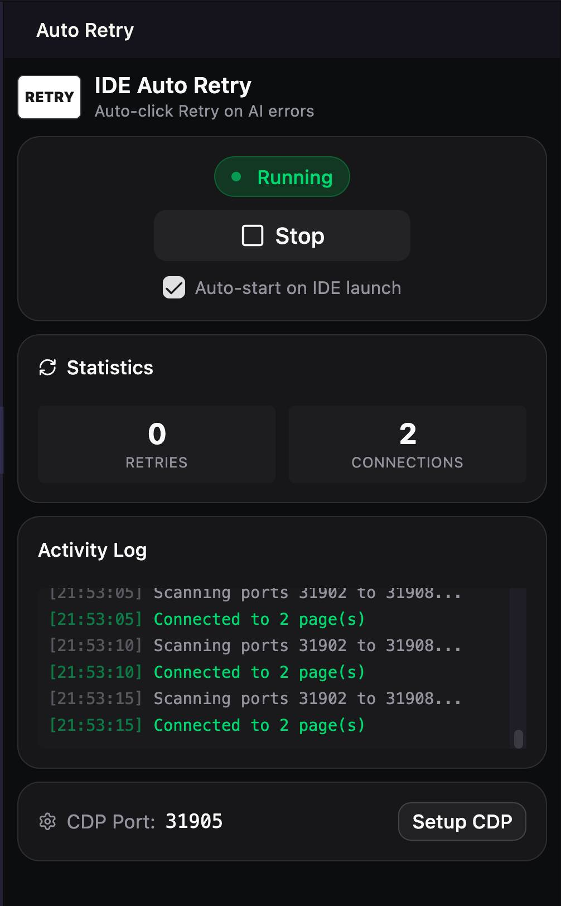

# IDE Auto Retry & Auto Accept All

⚡ **Auto-click Retry & Accept All buttons when AI coding agents encounter errors.**

Zero-babysitting automation for VS Code, Cursor, Antigravity, and compatible editors.



## Features

- 🔄 **Automatic Retry** — Automatically clicks "Retry" buttons when AI agents (Gemini, Copilot, Claude, etc.) encounter errors. Uses MutationObserver to react instantly to DOM changes, plus interval-based polling as a fallback.
- ✅ **Auto Accept All** — Optionally auto-clicks "Accept All" buttons in agent panels (e.g. Antigravity), so you don't have to manually approve each suggestion.
- 🛡️ **Safety Blocklist** — Blocks dangerous commands (e.g. `rm -rf /`, fork bombs, `format c:`) before clicking Retry, preventing catastrophic execution.
- 📊 **Status Bar Integration** — Real-time status indicator in the VS Code status bar:
  - 🟢 Green dot when running, gray circle when stopped
  - Shows retry & accept counts (e.g. `● IDEAutoRetry: 3 retries, 2 accepts`)
  - Click to open the side panel
- 🖥️ **Cross-Platform** — Works on macOS, Windows, and Linux with platform-specific CDP setup (wrapper scripts, shortcut modification, `.desktop` file editing).
- 🎛️ **Modern Webview Panel** — Side panel built with React + shadcn/ui featuring:
  - One-click Start/Stop toggle
  - Auto-start & Accept All checkboxes
  - Real-time statistics (Retries, Accepts, Connections)
  - Activity log with timestamps
  - Max connections control (with +/- stepper)
  - CDP setup button
- ⚙️ **Auto-Start** — Option to automatically start monitoring when the IDE launches.
- 🔌 **Smart Connection Management** — Scans a configurable port range, supports multiple CDP connections with LRU eviction when the maximum is reached.
- 🌲 **Deep DOM Traversal** — Searches through iframes, frames, webviews, and shadow DOM trees to find Retry/Accept buttons in nested agent panels.
- 🚀 **Optimized Performance** — Document caching, debounced mutation callbacks, optimized polling intervals, and proper cleanup of observers and WebSocket connections.

## Requirements

This extension uses Chrome DevTools Protocol (CDP) to interact with the IDE. You need to launch your IDE with a special flag:

```bash
# macOS — Antigravity
open -a "Antigravity" --args --remote-debugging-port=31905

# macOS — Visual Studio Code
open -a "Visual Studio Code" --args --remote-debugging-port=31905

# macOS — Cursor
open -a "Cursor" --args --remote-debugging-port=31905

# Windows
code.exe --remote-debugging-port=31905

# Linux
code --remote-debugging-port=31905
```

**Or use the built-in Setup:**
1. Click the **"Setup CDP"** button in the extension panel
2. The extension will create a wrapper script (macOS), modify shortcuts (Windows), or edit `.desktop` files (Linux)
3. Follow the on-screen instructions to restart your IDE

## Usage

1. Open the **IDE Auto Retry** panel from the Activity Bar (sidebar icon)
2. Click **"Start"** to begin monitoring
3. The extension connects via CDP, injects a monitoring script, and automatically clicks Retry buttons when AI errors occur
4. Enable **"Auto Accept All"** to also auto-click Accept All buttons in agent panels
5. Monitor activity in the **Statistics** and **Activity Log** cards

## Settings

| Setting | Default | Description |
|---------|---------|-------------|
| `ideAutoRetry.enabled` | `true` | Enable/disable the extension |
| `ideAutoRetry.autoStart` | `false` | Auto-start when IDE launches |
| `ideAutoRetry.acceptAll` | `false` | Auto-click "Accept All" buttons in agent panels |
| `ideAutoRetry.cdpPort` | `31905` | CDP remote debugging port |
| `ideAutoRetry.cdpPortRange` | `3` | Port range to scan (port ± range) |
| `ideAutoRetry.pollInterval` | `1000` | Interval between retry checks (ms) |
| `ideAutoRetry.cooldown` | `5000` | Cooldown after clicking retry (ms) |
| `ideAutoRetry.maxConnections` | `10` | Maximum CDP connections (LRU eviction when exceeded) |

## Commands

| Command | Description |
|---------|-------------|
| `IDE Auto Retry: Start` | Start auto-retry monitoring |
| `IDE Auto Retry: Stop` | Stop auto-retry monitoring |
| `IDE Auto Retry: Toggle` | Toggle auto-retry on/off |
| `IDE Auto Retry: Setup CDP` | Setup Chrome DevTools Protocol for your IDE |
| `IDE Auto Retry: Open Panel` | Open the extension side panel |

## How It Works

1. The extension connects to your IDE via **Chrome DevTools Protocol** (WebSocket)
2. It scans a port range (default `31905 ± 3`) for active CDP endpoints
3. A monitoring script is injected into each discovered page/webview
4. The script uses **MutationObserver** + interval polling to detect "Retry" buttons in error contexts
5. When a Retry button is found within an error message, it automatically clicks it
6. If **Accept All** is enabled, it also clicks "Accept All" / "Accept all" buttons
7. The script traverses **iframes, frames, webviews, and shadow DOMs** to find buttons in nested panels
8. Dangerous commands are checked against a blocklist before clicking

## Safety Features

The extension includes a blocklist of dangerous commands that prevents auto-clicking when detected:

- `rm -rf /`, `rm -rf ~`, `rm -rf *` — Destructive file deletion
- `format c:`, `del /f /s /q`, `rmdir /s /q` — Windows destructive commands
- `:(){:|:&};:` — Fork bombs
- `dd if=`, `mkfs.`, `> /dev/sda` — Disk overwrite commands
- `chmod -R 777 /` — Dangerous permission changes

## Troubleshooting

### "CDP not available" error

Your IDE wasn't launched with the required flag:
1. Click **"Setup CDP"** in the panel and follow the instructions
2. Or restart your IDE with `--remote-debugging-port=31905`

### Extension not clicking Retry

1. Make sure the extension status shows **"Running"** (green dot in status bar)
2. Check that you have at least 1 connection in the Statistics card
3. Verify the Retry button is in an error context (error/failed/terminated message must be visible nearby)

### Too many connections

If you experience performance issues, reduce the **Max Connections** setting in the panel (default: 10). The extension uses LRU eviction to manage connections.

## License

MIT License — see [LICENSE](LICENSE) for details.

## Contributing

Contributions are welcome! Please open an issue or pull request on [GitHub](https://github.com/xmannv/IDEAutoRetry).
